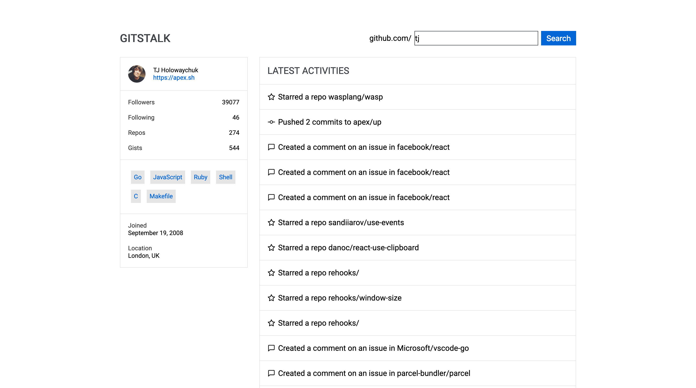

# [Gitstalk](http://gitstalk.surge.sh) 🔎

[](https://github.com/prettier/prettier)
[](https://github.com/malcodeman/gitstalk/blob/master/LICENSE)

Angular project based learning app.



## Usage

```
npm install
npm start
```

## Documentation

If you wish to deploy to [surge.sh](https://surge.sh) just edit `domain` variable in package.json to your liking and run `npm run deploy` command.

```
"domain": "gitstalk.surge.sh"
```

## Credits

- [Roboto font](https://fonts.google.com/specimen/Roboto)
- [Abhishek Sharma](https://github.com/littlewonder) for creating original [gitstalk](https://github.com/littlewonder/gitstalk).

## License

This project is licensed under the MIT License - see the [LICENSE](LICENSE) file for details.
